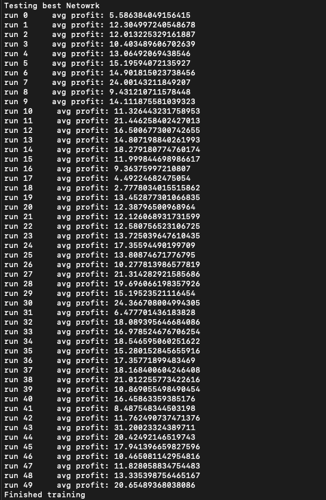

# NEAT-Python Trading Algorithm

## System Design

## Overview

This repository contains a trading algorithm implemented using the NEAT (NeuroEvolution of Augmenting Topologies) algorithm in Python. The trading algorithm aims to generate high profits by autonomously trading stocks based on historical price data.

## How it Works

The algorithm follows the following steps:

1. Data Collection: The algorithm collects historical price data for stocks from one or more sources. This data is saved to a database for further processing.

2. Preprocessing: Over a certain amount of time, the algorithm takes rolling 90-day trading windows of the stock data. Within each window, the data is normalized to account for variations in stock prices.

3. Neural Network Evolution: NEAT is employed to evolve neural network architectures and parameters that represent trading strategies. Each neural network is trained using historical price data to predict optimal trading decisions.

4. Trading: The evolved neural networks are applied to the normalized data to generate buy/sell signals. The algorithm executes trades based on these signals, aiming to achieve a high profit percentage over time.

5. Evaluation and Optimization: The algorithm continuously evaluates the performance of the trading strategies and adjusts the neural networks through evolutionary processes to improve profitability.

## Requirements

- See requirements.txt in base directory

To use the trading algorithm, follow these steps:

1. Install the required dependencies using pip install -r requirements.txt.

2. Update base paremeters in main.py and config.txt

3. Run the main script main.py to start the algorithm.

## Configuration

You can configure various aspects of the trading algorithm, including:

- NEAT algorithm parameters (e.g., population size, mutation rates)
- Database connection settings
- Stock selection and data retrieval parameters
  Modify the configuration files (config.txt) to customize the algorithm according to your requirements.

## Run Results

With a fitness threshold of 75 (75 percent gains) I was able to train and find a model saved in the best.pickle file.

Trying the best model with multiple runs shows consistently positive returns with backtesting.

